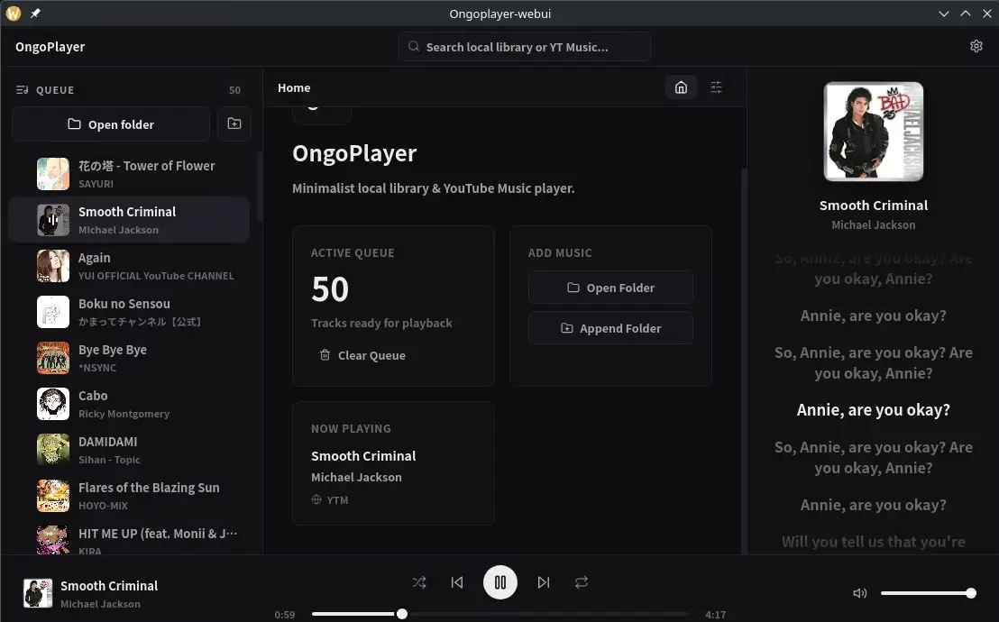

# OngoPlayer 

A dead simple music player that just works.
for the audio backend OngoPlayer uses [purego](https://github.com/ebitengine/purego) to call native audio libraries directly at runtime, with no CGo involved. 
for the frontend OngoPlayer uses wails with svelte

## Features
- Plays local audio files (MP3, Opus, Vorbis, FLAC)
- streams from online source like Youtube
- Automatic lyric resolver from https://lrclib.net
- Clean and lightweight web UI for controlling playback and managing playlists

---

## Build
OngoPlayer main frontend is build using [wails](https://wails.io/) you may need to go to their site to learn more about how to build the app in your dev environment.

- [Wails installation instructions](https://wails.io/docs/gettingstarted/installation)
- [Wails cli reference](https://wails.io/docs/reference/cli)

for linux specifically on fedora 43 (my environment) you need to install this package:

`webkit2gtk4.1-devel`

and run wails dev and wails build with `-tags webkit2_41`.
on wails doctor, if you see the libwebkit column said "not found" just ignore it, just make sure you are using `-tags webkit2_41`.

you may need pnpm package manager for installing the frontend dependencies, you can install it from [pnpm.io](https://pnpm.io/installation). you also need a C compiler to build the libdsp, you can install [w64devkit](https://github.com/skeeto/w64devkit) for windows or gcc for linux.

### Runtime dependencies (audio codecs)
the app need these runtime dependencies to play audio files: 
libvorbisfile, libopusfile, libmpg123, libflac and sdl3 
On linux these package usually comes built in, if one of them missing you can install it from your package manager, the app debug will tell you which one is missing.

On windows you **do not need to download any of these dependencies**, it comes built in on the installer.

## Download
You can download the latest build release from the [release](https://github.com/Dlcuy22/OngoPlayer/releases) page or go to the actions and download it from the latest build artifacts.

Status: The app is still in early development, many features are not yet implemented, and the app may have bugs. Please report any issues you encounter on the [issues](https://github.com/Dlcuy22/OngoPlayer/issues) page.
