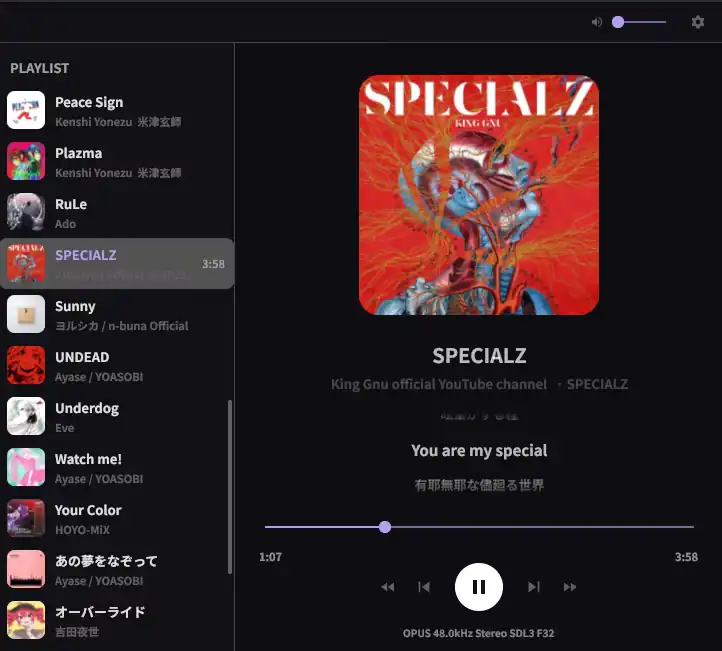

# OngoPlayer [](https://github.com/Dlcuy22/OngoPlayer/actions/workflows/build.yml)



## A dead simple Music player that just works

OngoPlayer uses [purego](https://github.com/ebitengine/purego) to call native audio libraries directly, avoiding the overhead of CGo and providing a fast, efficient audio playback experience.

### Why use C libs in the first place?

Because almost all audio codec implementations that are actually efficient and fast are written in C, and I don't want to reimplement all of them in Go, nor can I guarantee the same speed and performance as the official C implementations.

### 100% Go & Zero-Bloat

OngoPlayer's GUI uses [Gio](https://gioui.org), an immediate-mode GUI framework written purely in Go.

- **NO Electron**
- **NO WebViews**
- **Native GPU Rendering** (OpenGL / Vulkan) giving efficient UI interactions.

Because there is no heavy browser engine underneath, OngoPlayer is extremely lightweight, fast, and uses minimal system memory compared to standard modern desktop players.

### Features

- **GPU Accelerated GUI**: Uses Gioui for layout and rendering.
- **Dynamic Synced Lyrics**: Loads `.lrc` files locally or falls back to fetching them on the fly via the [LRClib API](https://lrclib.net), complete with auto-wrapping and scrolling.
- **Fast Audio Decoding**: Leverages SDL3 and native codecs (libopus, libvorbis, libmp3lame) using purego, zero CGo linking required.
- **Cross-Platform Folders**: Native folder-picker integration via D-Bus (Linux XDG Desktop Portal) and WinAPI (Windows).
- **Responsive Layout**: Wide track view, cover art caching, and customizable layout sizing.

### Linux Requirements

**Build Requirements**
To build OngoPlayer from source on Linux, you need development headers for SDL3 and Gio's GPU backend.

- `sdl3` (for the audio stream backend)
- `libvulkan-dev`, `libgl1-mesa-dev`, `libwayland-dev` / `libx11-dev` (for Gio graphics)
- `libxkbcommon-dev` (for keyboard input mapping)
- `dbus` (used by XDG Desktop Portal for the native folder picker)

**Runtime Requirements (Audio Codecs)**
Because OngoPlayer uses pure C-bindings at runtime (without CGo compiling), you must have the specific shared libraries (`.so`) installed on your system to play music:

- `libmpg123.so.0` (MP3 files)
- `libopusfile.so.0` (Opus files)
- `libvorbisfile.so.3` (Ogg Vorbis files)
- `libFLAC.so.14` or `libFLAC.so.12` (FLAC files)

Install them depending on your distribution:

**Debian/Ubuntu:**

```bash
sudo apt-get install libmpg123-0 libopusfile0 libvorbisfile3 libflac12
```

**Arch Linux:**

```bash
sudo pacman -S mpg123 opusfile libvorbis flac
```

**Fedora/RHEL:**

```bash
sudo dnf install mpg123-libs opusfile libvorbis flac-libs
```

If you are using PulseAudio or PipeWire for sound, SDL3 will pick it up automatically (you can enforce it during dev with `SDL_AUDIODRIVER=pulseaudio`).

### Windows (Coming Soon)

A pre-packaged Windows installer is currently in development! It will auto-bundle all necessary DLLs (like SDL3.dll) and dependencies out-of-the-box so you can run the app with absolute zero manual configuration.

### Roadmap

- [x] Usable, GPU-based graphical user interface (Gio)
- [x] Automatic synced lyric resolver & viewer ([LRClib](https://lrclib.net))
- [x] Add more lossless audio format support (FLAC bindings)
- [x] Full CJK font support for seamless lyric rendering
- [ ] Keyboard shortcut system (Space, Arrow keys, etc.)
- [ ] Multi-provider online music streaming (integrating `yt-dlp` for YouTube Music search & playback)
- [ ] Right Panel Expansion (Tabbed layout for Equalizer & Settings)

---

**Status:** In active development, still in early stage
